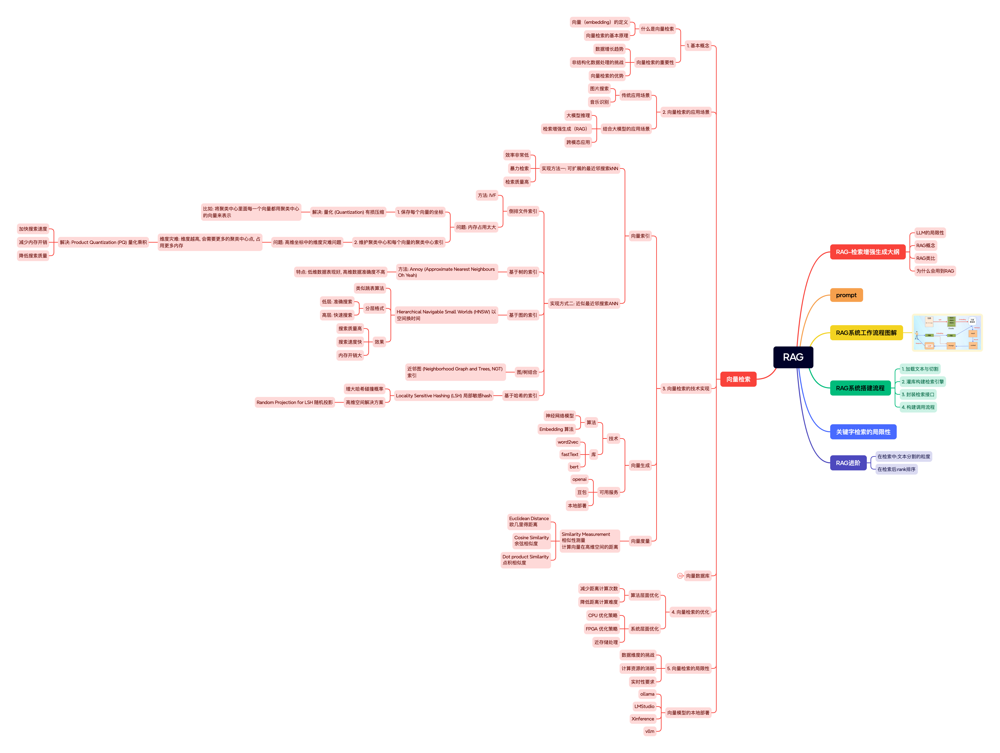

# 使用rag学习rag

> 可根据自己的学习自动增长的知识库
> ai时代的 哪里不会点哪里
> 构建知识库的有问题请咨询作者wx:kms-kng  一起构建你感兴趣的知识库


## 本文档使用说明

### 1. 拉取知识库

```
	git clone https://github.com/kms9/learn_rag_by_rag.git

```  

### 2. 安装vscode以及必要插件

  1. Vscode
  2. Markdown All in One
  3. Vscode github-copilot插件/通义灵码
  4. markmap插件(当前仅限vscode)

### 3. 打开项目之后 点击对应的图标 大纲预览
  1. 打开项目readme.md文件
  2. 点击markmap插件按钮 展示文档mindmap
  3. 效果预览 

## 信息更新

1. 本文档持续更新 完成整个rag基础资料 
2. 跟踪rag最新技术 