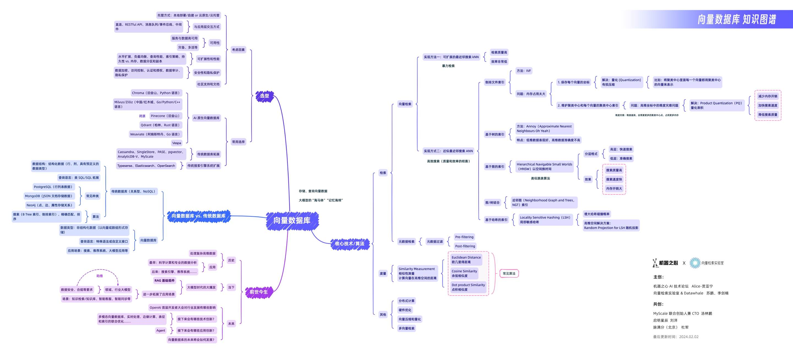

# 向量检索

本项目旨在创建一个全面、易于理解的向量检索教程，它将覆盖从基础理论到核心技术的各个方面。教程将通过详细的解释、实例和实践案例，帮助初学者、研究人员以及应用人员深入理解并有效地使用向量检索技术。

*下图是机器之心联合 Datawhale 和向量检索实验室一起出品的向量数据库知识图谱，让大家初步了解一下向量检索领域。*

## 项目受众

- 初学者， 从基础了解向量检索。
- 应用人员，需要实际开发应用向量检索技术。
- 开发人员 深入了解对应的不同向量策略之前的区别

## 目录

- 第一部分：引言
  - [引言](./docs/chapter1/1.1%20introduction.md)
    - 什么是向量检索
    - 向量检索的基本概念
    - 向量检索为什么重要
    - 向量检索的应用场景
    - 关键词检索与向量检索的原理对比
    - 本教程适合的人群
- 第二部分：核心技术
  - [2.1 向量化技术](./docs/chapter2/2.1%20embedding.md)
    - Embedding 的定义
    - 为什么需要 Embedding
    - NLP 中经典的 Embedding 算法
    - 大模型时代下的 Embedding 算法
  - 向量索引
    - [2.2 向量索引](./docs/chapter2/2.2%20index.md)
      - 向量索引
      - 向量索引的评估指标
    - [2.2.1 基于量化的向量索引方法](./docs/chapter2/2.2.1%20pq-based-index.md)
    - [2.2.2 基于哈希的向量索引方法](./docs/chapter2/2.2.2%20hash-based-index.md)
    - [2.2.3 基于树的向量索引方法](./docs/chapter2/2.2.3%20tree-based-index.md)
    - [2.2.4 基于图的向量索引方法](./docs/chapter2/2.2.4%20graph-based-index.md)
    - [2.2.5 基于混合的向量索引方法](./docs/chapter2/2.2.5%20hybrid-index.md)
  - [向量查询](./docs/chapter2/2.3%20vector-query.md)
    - 向量查询方法概述
    - k近邻查询
    - 范围查询
    - 混合查询
    - 多向量查询
    - 其它查询
    - [查询优化](./docs/chapter2/2.3.1%20algorithm.md)
  - [向量检索软硬协同优化](./docs/chapter2/2.4%20hw-sw-codesign.md)
    - [CPU 优化策略](./docs/chapter2/2.4.1%20CPU.md)
    - [FPGA 架构与向量检索](./docs/chapter2/2.4.2%20FPGA.md)
    - [近数据处理架构](./docs/chapter2/2.4.3%20Near-Storage-Processing.md)
- 第三部分：系统实现与应用
  - [向量数据库系统概述](./docs/chapter3/3.1%20system.md)
  - [什么是RAG](./docs/chapter3/3.2%20RAG.md)
  - 基于RAG的知识问答系统实战
    - [基于Langchain的RAG基础实现](./docs/chapter3/3.2.1%20practice.md)
    - [基于Ragas的RAG评价体系](./docs/chapter3/3.2.2%20evaluation.md)
- [第四部分：未来展望和挑战](./docs/chapter4/4.1%20challenge.md)
- [结语](./docs/chapter5/5.1%20summary.md)